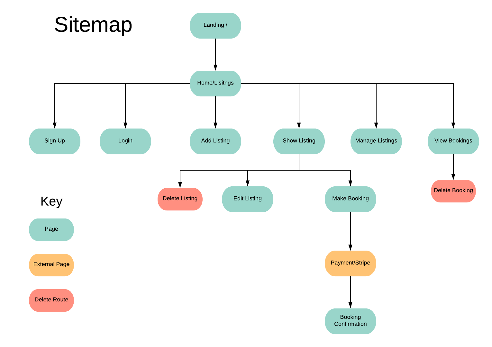
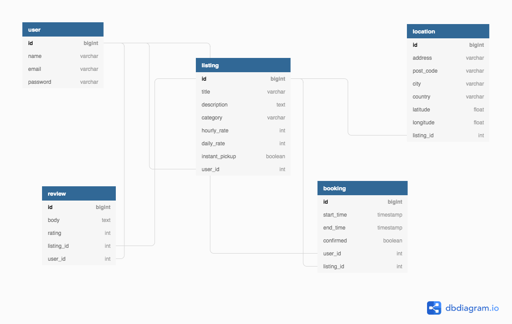
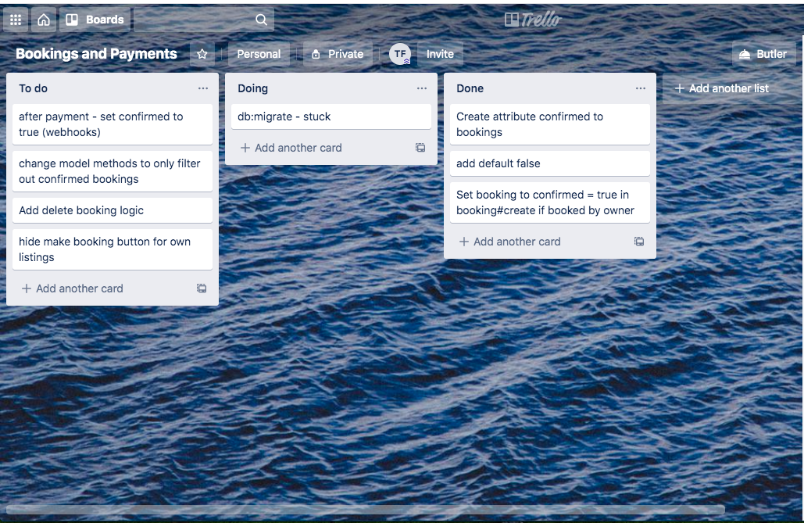

# README

What is the problem the problem that is being solved?
---

The BikeFinder app is a peer to peer bike share service. There are many people who would like to have access to a bike on occasion but either don't have the space at home to own one, or may be travelling and don't have their own bike with them. While city bike share services go some of the way towards solving this problem, they are only available in some cities, usually only offer one type of bicycle and are not practical for all locations and types of cycling. A peer to peer bikeshare service would allow owners of under-utilized bicycles to rent them to anyone who wants to use them. 

Why is it a problem that needs solving?
---

The benefits of cycling are numerous. It is a great form of exercise, a convenient and environmentally friendly transport option and lots of fun. This app will encourage more people to enjoy the many benefits of cycling by providing a low commitment option for those who it may not be practical to own their own bike.

Link to app
---

Github Repository
---
https://github.com/tessssssssy/bikeshare-app

Description of your marketplace app (website), including:
- Purpose
- Functionality / features
- Sitemap
- Screenshots
- Target audience
- Tech stack (e.g. html, css, deployment platform, etc)

Purpose
---
This app provides a platform for connecting people who want rent out their bicycles to those who may be looking for a bike to ride but don't want to buy their own.

Features
---

- Index page displaying all bikes available, with filtering for location and dates available

- Users can log in or sign up 

- Users can add their bikes to the site to be rented out by users, they can set their own prices and availability, they can also edit and delete their own listings

- Users can view details for one bike, including it's availability and reviews

- Users can make booking for a bicycle, pay a deposit and then will be given contact details of the owner to pick it up

- Users can review bikes and rate them

- A map showing the locations of bikes available

Sitemap
---

Screenshots
---

Target Audience
---
- Bicycle owners - includes enthusiasts who own multiple bikes that can't use them all at once or bicycle owners who only occasionally ride their bikes
- Travellers - may not have access to a bicycle when they travel but want to use one
- Apartment dwellers - who don't have the space to own a bicycle
- Occasional cyclists - people who don't ride enough to justify buying a bike but would like to use one occasionally

Tech stack
---
- Ruby on Rails
- Postgresql
- Heroku
- AWS S3
- Git/Github

R12	User stories for your app

1. As a cycling enthusiast, I own six bicycles which are all necessary and serve different purposes but for obvious reasons cannot be all used at the same time. I would like to upload my bikes to an app to be rented out when I'm not using them so that I can make some extra money to fund my expensive hobby. 

2. I am a bicycle owner who just moved house and want to update my listing to show the correct address

3. As a traveller, I love to explore new places by bicycle but I left mine at home because taking it on a plane is expensive and painful, and the city I'm visiting does not have it's own bike share. I'd like to be able to rent out a bicycle at short notice for a few hours to explore the city.

4. I am a bicycle owner, I decided I like my bike too much. I want to remove my listing so I get ride it 24/7

5. As a bicycle owner, I have my bike listed for rental but have realized I need it this weekend. I want to be able to be able to mark it unavailable without removing the listing. 

6. As an experienced mountain biker, I want to be able to rent a bike whenever I go away on holiday without bringing my own. Before I rent a bike I would like to look at reviews and ratings by other users to ensure I'm getting good quality.

Wireframes
---
 

Entity Relationship Diagram
---
 

High-level components (abstractions) 
---

Active Record

Active Storage

Action Views

Third Party Services
---

- AWS - Amazon Simple Storage Service (Amazon S3) is an object storage service used to store and protect data for websites and applications. This app will use Amazon S3 image buckets to store images uploaded by users.

- Stripe - Online payment processing is something that requires  a high level of security to deal with user credit card details which is well beyond the scope of this project. Therefore it is important to make use of a service which can provide the level of security needed. Stripe is a software platform that processes online payments for businesses such as e-commerce stores. This app will use stripe to handle user payments. 

Describe your projects models in terms of the relationships (active record associations) they have with each other
---

User - created with devise, can have many listings, bookings and reviews

Listing - belongs to a user, belongs to a location. 

Location - A location can have many listings, a listing belongs to a location

Booking - belongs to a user and belongs to a listing, a user can have many bookings, a listing can have many bookings

Review - belongs to a user and belongs to a listing, a listing can have many reviews, a user can give many reviews

Discuss the database relations to be implemented in your application
---

My database consists of five tables. The listing table is the most central structure in the app. It represents a bicycle that can be uploaded by a user (the owner), and then booked out by other users and also reviewed by other users. A listing can have many bookings and reviews and it belongs to one user. It also references a location. I initially had the location as a column on the listing model itself, but decided to refactor it into it's own table to implement database normalization, as some locations can have multiple listings (such as a user who owns multiple bikes). A booking belongs to a user and a listing, and a listing can have many bookings. A review belongs to a user and belongs to a listing. 

Project Management and tracking tasks
--- 

I used Trello to track tasks and manage my time throughout the project. 

- I created separate boards for different features of the app, such as listings, bookings and payments, with each board having separate lists for to do, doing and done. I'd write a card for each task, starting in the to do list and then would move tasks across as they were completed

One of my Trello boards
--- 
 

- However, when it came to tracking the finer details, like the steps needed to complete each task, and then test the feature was working, as well as brainstorming and working out how to implement features, I found pen and paper to be the most useful and time efficient tool.

My Workings
---
 
 

